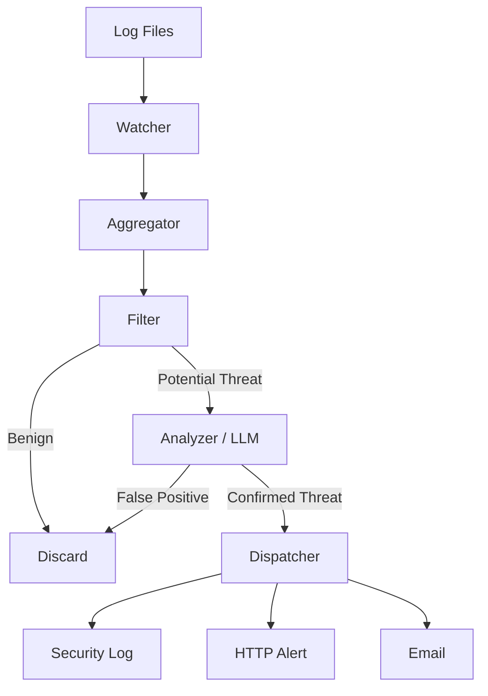

# LogSentinel

LogSentinel is a lightweight, AI-powered log analysis tool designed to detect security threats in real-time. It uses a hybrid approach combining traditional pattern matching with advanced Large Language Models (LLMs) to identify anomalies, attacks, and vulnerabilities in your application logs.

[](./LICENSE)
[](https://www.rust-lang.org)

## Features

- **Real-time Monitoring**: Tails log files as they grow, analyzing entries instantly.
- **Hybrid Detection Engine**:
    - **Threat Signatures**: Fast, rule-based detection using exact, case-insensitive, and regex patterns.
    - **AI Analysis**: Deep context evaluation using LLMs (Ollama, OpenAI, Gemini, Claude).
- **Multi-Cloud/Local AI**: Seamlessly switch between local models (Ollama) and cloud providers.
- **Intelligent Batching**: Optimizes LLM requests via batch processing to reduce latency and costs.
- **Alerting & Dispatching**: 
    - Log suspicious activities to a security audit file.
    - Send notifications to a BFF (Backend For Frontend) API.
    - Email notifications for critical alerts.
- **Performance Focused**: Built with Rust and Tokio for high throughput and low resource footprint.
- **Observability**: Built-in Prometheus metrics exporter on port 9090.

## How it Works

LogSentinel operates as a pipeline:
1. **Watcher**: Monitors log files (e.g., `catalina.out`, `access.log`) for new entries.
2. **Aggregator**: Handles multi-line logs (like Java stack traces) to preserve context.
3. **Filter**: Performs initial rapid screening using `signatures.toml`.
4. **Analyzer**: Sends suspicious candidates to the configured LLM for final verdict.
5. **Dispatcher**: Handles rate-limiting and routes alerts to configured sinks (Local Log, API, Email).



## Installation

### Prerequisites

- Rust 1.70 or higher
- [Ollama](https://ollama.com/) (Optional, for local AI)

### Building from Source

```bash
git clone https://github.com/gasparoriol/LogSentinel.git
cd LogSentinel
cargo build --release
```

## Usage

### Configuration

LogSentinel requires a `config.toml` (main settings) and a `signatures.toml` (threat patterns).

1. Copy the example configuration:
   ```bash
   cp config.toml.example config.toml
   ```
2. Adjust `config.toml` to point to your log files and choose your AI provider.

### Running

```bash
./target/release/log_sentinel --config config.toml
```

### Options

```bash
Options:
  -c, --config <CONFIG>              Path to config file
  -d, --daemon                       Run in background
      --api-key-file <API_KEY_FILE>  Path to file containing LLM API key
  -h, --help                         Print help
  -V, --version                      Print version
```

## Threat Signatures

Define your own detection rules in `signatures.toml`:

```toml
[[signatures]]
id = "sqli-union"
pattern = "UNION SELECT"
type = "case_insensitive"
description = "Typical SQL injection probe."
```

## License

This project is licensed under the MIT License - see the [LICENSE](LICENSE) file for details.


